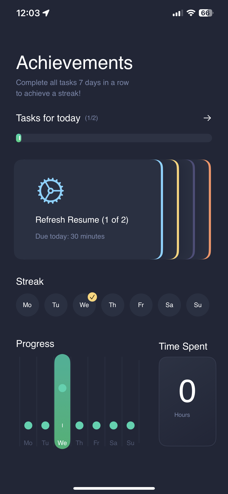
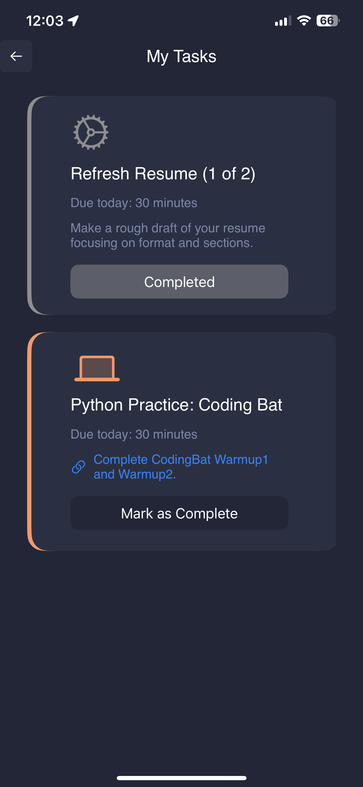

# Interview Ace

## Privacy Policy
The Interview Ace does not capture or share any data or user information.

## Contact Info
Contact Sean at scoyne@seancoyne.org

# Download in the iOS App Store: COMING SOON!
Ace the Data Engineering Interview in 30 Days. In just 1 hour per day build the necessary skills to be an interview ace. Stay on track with your preparation in order to ace the data engineering interview! Daily tasks help you build the right skills, and keep the right pace. Track your progress through daily streaks and time invested.

## Preview

## CI/CD 
CI/CD is handled by Xcode Cloud. Each time a change is pushed to the main branch of this repo, Xcode Cloud generates a new build which includes running automated tests, archiving the build, and making the build available to internal and external testers. For members of the development team, the Xcode Cloud console can be found [here](https://appstoreconnect.apple.com/teams/69a6de89-436e-47e3-e053-5b8c7c11a4d1/apps/6465748534/ci/groups).
